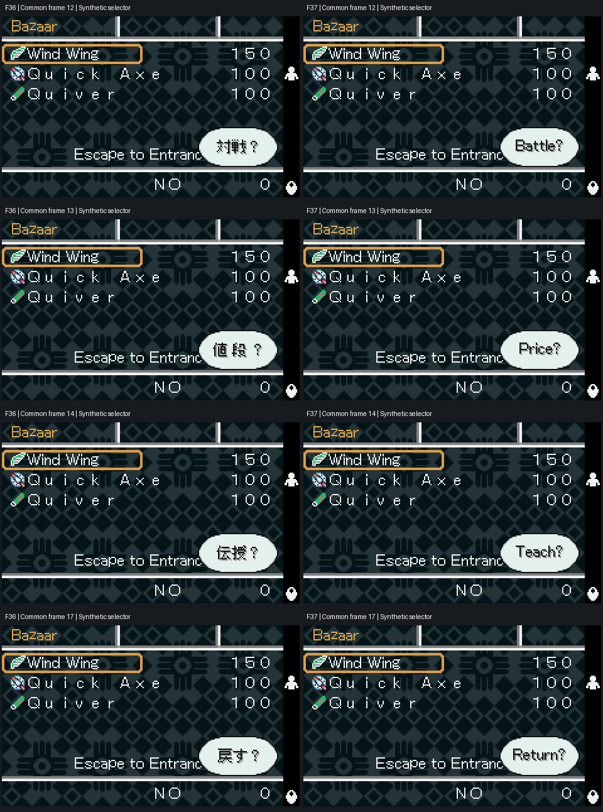

# Star Hearts — WonderSwan Color English Translation

**Current build: F37 · experimental / internal testing · Japanese → English**

This repository contains the cumulative translation build inputs, a BPS patch applied directly to the original Japanese ROM, technical research, and reproducible validation evidence. F37 adds four translated prompt graphics to F36, which translated the purchase interface and 181 initial actor-name fields plus one additional inline name.

The F37 four-prompt translation and synthetic rendering scope is complete. Whole-game linguistic, visual and functional approval is not claimed. This is a test build, not a final release or an approved release candidate.

## Download and patch

Use [StarHearts_EN_phase13BG_F37_CUMULATIVE_FROM_JP.bps](patches/F37/StarHearts_EN_phase13BG_F37_CUMULATIVE_FROM_JP.bps) with your own original Japanese ROM and a BPS-compatible patcher. Apply it once to the original ROM; older translation patches are not prerequisites.

The original file was used locally as `StarHearts_JP.wsc`; its filename may differ. Identify it by size and hash:

| Image | Bytes | SHA-256 | CRC32 | WS checksum |
| --- | ---: | --- | --- | --- |
| Original Japanese ROM | 4,194,304 | `64179c9924ec1280861ebd83b99aaeb0770701051e590613430ae9a6dbe31255` | `138D1018` | `8EED` |
| F37 English output | 4,194,304 | `f0791dcf53045afc126ce11ed5b9eb7091c47c1c8195eaa525737c5fec5ffb57` | `3F4A45E0` | `DB46` |

Patch size: **649,925 bytes**. Patch SHA-256: `dba7b7f5cd2a4980f2ae7af9ed80b5bef6b8042279dda0f46ba00084696eddde`.

No complete ROM, BIOS or emulator is included.

## What changed

| Build | Change |
| --- | --- |
| F37 | `対戦？` → `Battle?`, `値段？` → `Price?`, `伝授？` → `Teach?`, `戻す？` → `Return?` |
| F36, retained | `バザー` → `Bazaar`, `買う？` → `Buy?`; 181 initial actor-name fields and one additional inline name |
| F35, retained | Local redraw of 14 main-menu labels; its typography trade-off is documented in the historical notes |

F37 reuses native Latin glyph masks for its four prompt graphics. Three fit their existing compressed slots; `Return?` uses a guarded relocation and one frame-pointer update. The delta from F36 is 689 bytes. The earlier 181 name fields, their metadata and consumers remain unchanged.



The shop popup in these captures is a rendering fixture. These four labels are not newly enabled shop actions.

## Build from source

Use Python 3.12 and the Pillow version recorded in [requirements.txt](requirements.txt). The packaged build was checked on Linux with Python 3.12.14 and Pillow 12.3.0. Windows and macOS wrappers are supplied, but were not executed on those operating systems.

Windows, from the repository directory:

```bat
python -m pip install -r requirements.txt
mkdir build
BUILD.bat "C:\path\StarHearts_JP.wsc" -o "build\StarHearts_F37.wsc" --bps "build\StarHearts_F37.bps"
```

Linux:

```sh
python3 -m pip install -r requirements.txt
mkdir -p build
./build.sh /absolute/path/StarHearts_JP.wsc -o build/StarHearts_F37.wsc --bps build/StarHearts_F37.bps
```

macOS, from Terminal in the repository directory:

```sh
python3 -m pip install -r requirements.txt
mkdir -p build
sh build.command /absolute/path/StarHearts_JP.wsc -o build/StarHearts_F37.wsc --bps build/StarHearts_F37.bps
```

Run the builder with normal Python settings, without `-O` or `PYTHONOPTIMIZE`: its validation guards use assertions. Output directories must already exist. No Wonderful toolchain or emulator is required to build this translation.

The build uses the bundled baseline BPS, cumulative change records, graphics assets and all dependent builders. These inputs are sufficient to reconstruct the known F37 output from the original ROM. The historical baseline remains a binary patch input; this repository does not claim to provide a decompilation or editable original source for every change already contained in that baseline.

## Validation and limits

| Scope | Evidence |
| --- | --- |
| Build and cumulative BPS | Clean-ROM build, independent BPS application, expected hashes and checksum pass |
| Four F37 graphics | 4/4 native rendering checks and 4/4 diagnostic state reloads pass through synthetic access |
| Consumer trace | 77 direct decoder calls, 19 mode records and 18 loader callsites audited; no selection of these four frames in those bounded paths |
| Buying/selling regression | 36 captures match F36 byte for byte |
| Initial actor names | 181/181 native loading checks passed in F36; evidence remains valid through verified unchanged F37 dependencies |
| Whole-game approval | Not established; the 181 loading checks are not 181 individual visual approvals or natural scene visits |

The four graphic resources are classified as retained resources without selection in the audited routes. Synthetic rendering closes this local task; it does not prove natural reachability, the behavior of an associated action, or global non-use. The current F37 hardware path and a complete natural playthrough have not been validated in this package.

## Repository guide

| Location | Contents |
| --- | --- |
| [Technical report](docs/technical/TECHNICAL_F37.md) | F37 addresses, compression sizes, relocation, consumer research and replay instructions |
| [PROJECT_STATE_F37.json](docs/status/PROJECT_STATE_F37.json) | Current machine-readable state |
| [CHANGELOG.md](docs/project/CHANGELOG.md) | F35–F37 changes and this packaging revision |
| [Validation](docs/validation/VALIDATION_F37.md) | Evidence index, savestate provenance and outstanding scope |
| [docs/history](docs/history) | Preserved historical reports, including the detailed F36 name-consumer analysis |
| [Source map](source/README.md) | Builders, assets, baseline and manifests grouped by phase under `source/` |
| [Patches](patches/README.md) | The single current end-user BPS under `patches/F37/` |
| [QA map](qa/README.md) | Current evidence, historical evidence, shared checkpoints and package validation |
| [SHA256SUMS.json](checksums/SHA256SUMS.json) | File-integrity inventory for this repository snapshot |
| [CREDITS.md](docs/project/CREDITS.md) | Project and tool attribution |

See the [folder guide](docs/STRUCTURE.md) and [file relocation index](docs/project/FILE_RELOCATION.csv) for the complete organization. Only the README, build entry points, dependency file and Git settings remain at the top level.

Historical documentation describes its own build. Its older pending items and wrapper targets do not override the F37 state. See [docs/history/README.md](docs/history/README.md) for that boundary.

For a bug report, include the ROM output hash, emulator/version or hardware setup, the shortest reproduction steps and a screenshot. Label any diagnostic state as synthetic and identify its build. Do not attach a complete ROM to an issue.

## GitHub release metadata

Suggested tag: `f37-test`. Suggested title: `Star Hearts English F37 — Test Build`. Mark the release as a pre-release and use the [release notes](docs/release/RELEASE_NOTES_F37.md) as its description. The standalone BPS is the player-facing asset; the full source ZIP also includes documentation and QA evidence.
